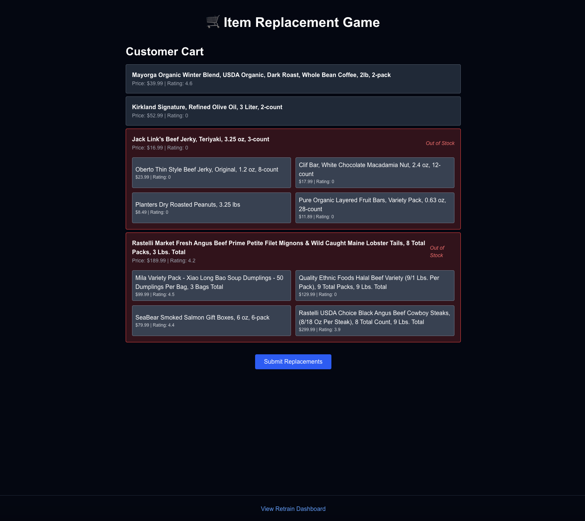

# **Item Replacement Recommendation Game**

This project simulates a gamified item replacement task inspired by real-world applications like Instacart, Amazon Fresh, and other online grocery platforms. Users are presented with a shopping cart containing unavailable items, and are asked to select suitable replacements. The system scores their choices and learns over time to better evaluate what makes a "good" replacement.

## **Project Goals**

- Simulate realistic decision-making in grocery shopping when items are out of stock.  

- Use user feedback to train a machine learning model that scores replacements.  

- Measure how close a replacement is to the original based on price, rating, and semantic similarity.  

- Design a system that is transparent, trainable, and open to continuous improvement.  

## **Features**

- Gamified UI where users pick replacements from options.  

- Backend generates shopping rounds with partial availability.  

- Score computed based on rule-based logic + optional ML model.  

- Feedback logging and model retraining from user input.  

- Retrain dashboard to visualize model performance over time.  

## **Dataset**

We used a publicly available grocery dataset from [Kaggle](https://www.kaggle.com/datasets/bhavikjikadara/grocery-store-dataset) with columns such as:

- title  

- subcategory  

- price  

- discount  

- rating  

- description  

### **Preprocessing decisions:**

- Prices were cleaned of currency symbols and parsed to floats.  

- Ratings were extracted from strings like “Rated 4.3 out of 5...” using regex.  

- Titles and descriptions were embedded using Sentence Transformers for semantic similarity.  

- Items were grouped by subcategory to ensure replacements are reasonably relevant.  

## **Architecture**

### **Frontend (Next.js + Tailwind CSS)**

- Displays a user-friendly item replacement game.  

- Handles session-level storage of user ID.  

- Sends selections to backend, receives predicted score.  

- Displays real-time score and feedback.  

### **Backend (FastAPI)**

- /generate_round: Generates a shopping cart and replacement options.  

- /predict_score: Scores a replacement using either:  
  - Rule-based logic (early stage fallback)  

  - ML model (once trained)  

- /log_feedback: Stores user interactions as JSONL for later training.  

- /retrain_logs: Returns metadata about past retrains.  

- Retrain process runs via script or scheduled trigger.  

## **Model Training**

### **Why ML?**

While a simple rule-based score (price difference + rating difference) works initially, we wanted a system that can learn:

- Implicit user preferences  

- Better weightings for different factors  

- How semantic similarity affects replacement quality  

### **Model**

- Input features:  
  - price_diff  

  - rating_diff  

  - has_rating  

  - semantic_similarity (cosine similarity between text embeddings)  

- Model used: Linear Regression (can be upgraded)  

- Trained via train_replacement_model.py  

- Retrain logs are saved to retrain_log.jsonl with metrics and timestamp  

## **Setup Instructions**

### **1\. Clone and prepare environment**

bash

CopyEdit

git clone <https://github.com/your-username/item-replacement-game.git>

cd item-replacement-game

python3 -m venv venv

source venv/bin/activate

pip install -r requirements.txt

### **2\. Prepare data**

Make sure your preprocessed item data with embeddings is saved as:

pgsql

CopyEdit

items_with_embeddings.json

You can use a script like prepare_items.py to clean and embed your data.

### **3\. Start backend**

bash

CopyEdit

uvicorn main:app --reload

Make sure this runs at <http://localhost:8000>.

### **4\. Start frontend**

bash

CopyEdit

cd frontend # or wherever your frontend lives

npm install

npm run dev

Navigate to <http://localhost:3000>.

## **Retrain Dashboard**

- Accessible at: <http://localhost:3000/retrain-dashboard>  

- Shows historical model performance over time (MSE, R², sample count)  

- Useful to monitor whether model learning is improving over time  

## **Key Design Decisions**

| **Decision** | **Reason** |
| --- | --- |
| Rule-based fallback | Provides immediate scoring even without ML model trained |
| --- | --- |
| Semantic similarity | Captures latent similarity between item descriptions |
| --- | --- |
| JSONL logging | Keeps feedback cheap to write and easy to parse incrementally |
| --- | --- |
| Gamified interface | Increases engagement while gathering valuable human signal |
| --- | --- |
| Dynamic user ID | Enables individual feedback tracking across sessions |
| --- | --- |

## **Future Work**

- Personalized scoring models per user  

- Better replacement diversity logic  

- Multi-choice scoring (e.g. ranking replacements)  

- Model versioning and promotion flow  

- Live retrain triggers or on-demand retrain UI